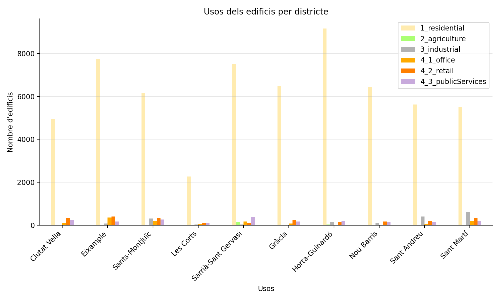
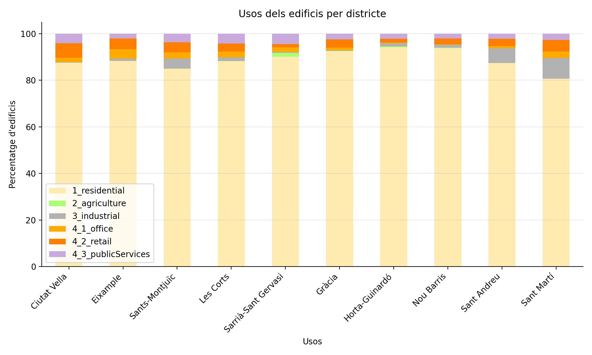

# Resultats
Visualització dels resultats d'execució dels diferents scripts dins de QGIS. 

---

### Anàlisi general de l'ús d'edificis a Barcelona

Distribució del nombre d'edificis per districte per ús

Distribució del percentatge d'edificis per districte per ús

