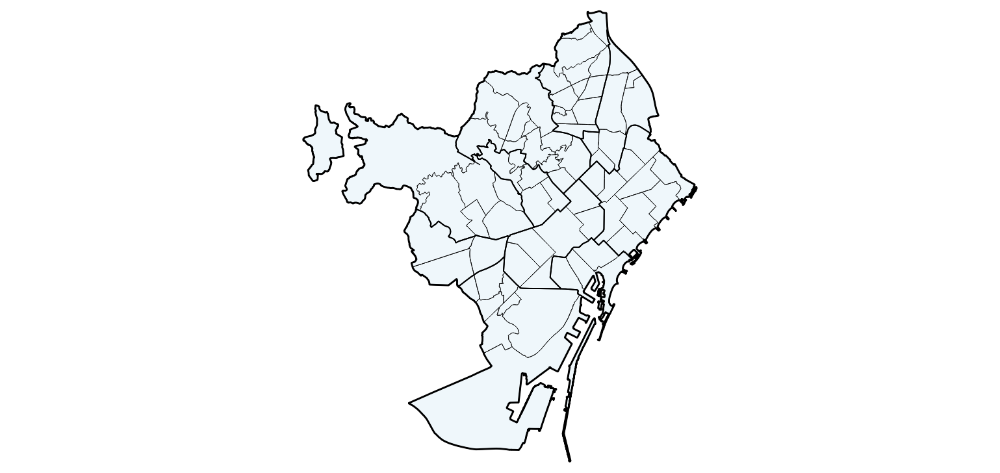
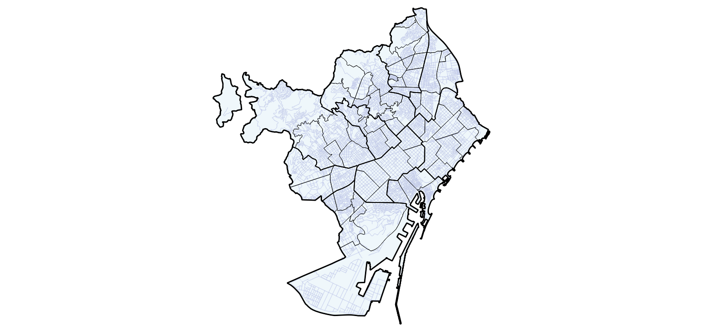
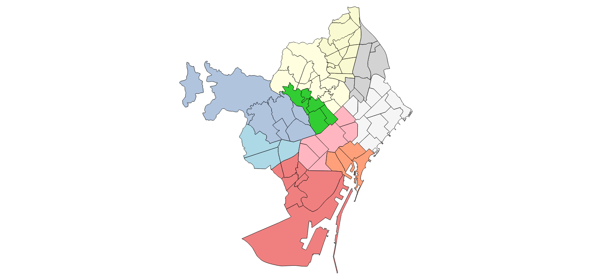
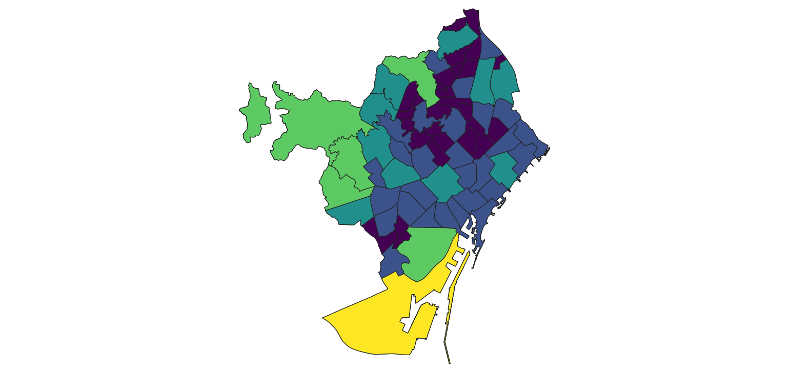
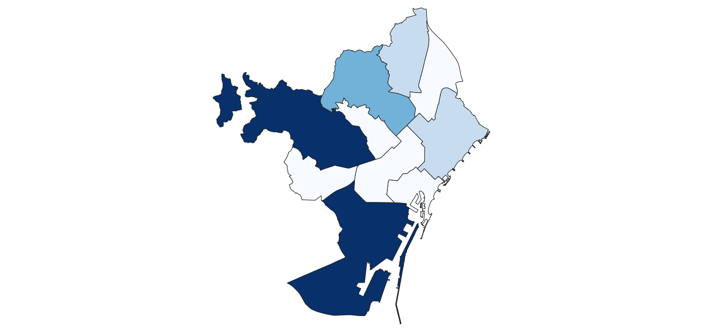
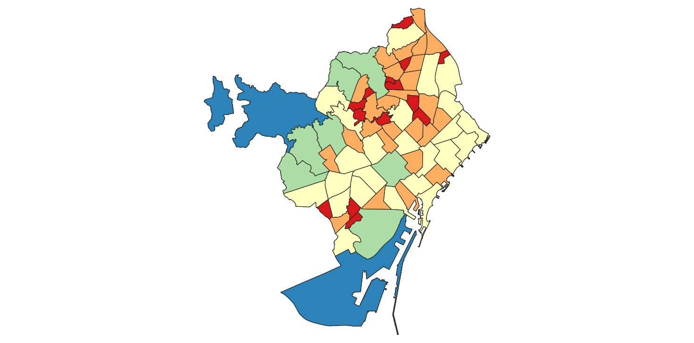
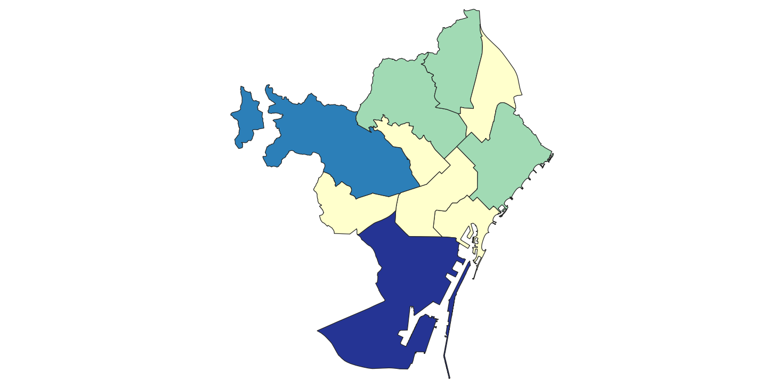

# Resultats
Visualització dels resultats d'execució dels diferents scripts dins de QGIS. 

---

### Simbolització
#### Simbologia única
Modificació de la simbologia per defecte a una simbologia més adequada, amb símbol únic

Addició del graf viari amb aplicació de simbologia

#### Simbologia categòrica
Aplicació de simbologia categòrica a la capa de Barris, segons el districte al qual pertanyen

Aplicació de simbologia categòrica a la capa de Districtes, segons el nom/codi

#### Simbologia graduada
##### Mètodes i Rampa de colors propis de QGIS
Aplicació de simbologia graduada a la capa de Barris en funció de la seva àrea

Aplicació de simbologia graduada a la capa de Districtes en funció de la seva àrea

##### Rangs manuals i colors interpolats de rampes de QGIS
Aplicació de simbologia graduada a la capa de Barris en funció de la seva àrea

Aplicació de simbologia graduada a la capa de Districtes en funció de la seva àrea

