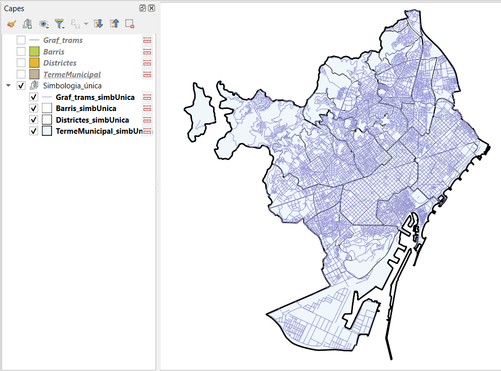

# Resultats
Visualització dels resultats d'execució dels diferents scripts dins de QGIS. 

---

### Inicialització
Inicialització del projecte i importació de les capes

---

### Simbolització
#### Simbologia única
Modificació de la simbologia per defecte a una simbologia més adequada, amb símbol únic

Addició del graf viari amb aplicació de simbologia

Actualització del panell de capes (TOC)

